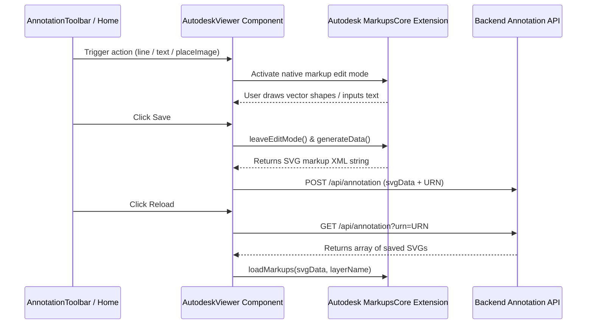

# Autodesk APS Viewer & PDF Watermark POC

This repository contains proof-of-concept integrations for Autodesk APS CAD rendering, markup annotations, and an independent PDF watermark visualizer.

## Features

1. **CAD Model Annotation**: Renders 2D/3D CAD models using the Autodesk APS viewer. Users can draw markups, place images, and load stored annotations.
2. **PDF Watermark Studio**: Visualizes custom dynamic watermark text overlays on PDF files using a modular React viewer powered by `react-doc-viewer`.

---

## AutoCAD / Autodesk APS Viewer & Annotation System

This project implements a full CAD model viewer and vector markup system powered by the **Autodesk Platform Services (APS)** Viewer (formerly Autodesk Forge).

### 1. Architectural Flow & Understanding
The CAD workspace uses the Autodesk JavaScript API to render models and handles annotations using SVG-based vectors overlaid directly on the viewer canvas.



### 2. Annotation & Markup Mechanics
The core annotation engine relies on the native `Autodesk.Viewing.MarkupsCore` extension. Markups are drawn as SVG graphics inside an overlay container synchronized with the viewer camera.

*   **Line / Arrow Tool**: Initializes `EditModeLine` (or `EditModeArrow`) from the Markups extension. Customizes stroke width (2px) and color (black `#000000`).
*   **Text Tool**: Enters `EditModeText` to let users type text notes directly on the model canvas with a custom text size.
*   **Image Placement Tool (Custom Overlay)**:
    *   Since native SVG image markup is not part of MarkupsCore default tools, the workspace uses a custom absolute-positioned DOM overlay during the placement phase.
    *   The user drags, resizes, and scales the image preview container.
    *   Upon confirmation, the app accesses `ext.svg` (the markup layer SVG element) and calculates the correct scale/offset coordinates using the SVG screen-to-matrix transformer (`screenRectToSvgCoords()` via `getScreenCTM()`).
    *   It appends a native SVG `<image>` tag containing the base64 data URL directly into the SVG DOM.
*   **Save Markup**: Calls `ext.generateData()` to compile all vector lines, text nodes, and custom embedded images into a single serialized SVG string, which is saved via a POST request.
*   **Reload Stored Comments**: Clears active comments and fetches persisted SVGs from the backend. Iteratively renders them back on the model via `ext.loadMarkups(svgData, layerName)`.

---

### 3. Component & Action Reference Guide

#### Component Files
*   **[src/app/page.tsx](file:///c:/Users/devel/Downloads/projects/aps-viewer-poc/src/app/page.tsx)**: Main page controller orchestrating document type selection, URN updates, and toolbar button triggers.
*   **[src/components/AutodeskViewer.tsx](file:///c:/Users/devel/Downloads/projects/aps-viewer-poc/src/components/AutodeskViewer.tsx)**: Embedded canvas component implementing viewer instance rendering, markup configuration, SVG coordination, and image overlays.
*   **[src/components/AnnotationToolbar.tsx](file:///c:/Users/devel/Downloads/projects/aps-viewer-poc/src/components/AnnotationToolbar.tsx)**: Floating markup toolkit supplying user click handlers for drawing actions.
*   **[src/hooks/useAutodeskViewer.ts](file:///c:/Users/devel/Downloads/projects/aps-viewer-poc/src/hooks/useAutodeskViewer.ts)**: Reusable React hooks managing global Autodesk initialization and model rendering state.

#### Action Invocation Signatures
The `AutodeskViewer` exposes a ref handle with the following API:
```ts
export type AutodeskViewerHandle = {
  invoke: (
    action: "line" | "text" | "save" | "clear" | "reload" | "placeImage",
    payload?: any
  ) => void;
};
```
*   `invoke("line")`: Activates the line/arrow drawing tool.
*   `invoke("text")`: Activates the text-box placement tool.
*   `invoke("placeImage", dataUrl)`: Enters the placement state to scale and position a base64 raster image.
*   `invoke("clear")`: Clears current markups from the canvas.
*   `invoke("save")`: Compiles all current markup SVGs and uploads them to the database.
*   `invoke("reload")`: Fetches stored annotations for the active URN and restores them onto the viewport.

---

## Git Branching & Merging Strategy

To maintain clean features and independent testing workspaces, follow these git guidelines:

### 1. Default Branch
*   **Default Branch**: `main`
*   All feature development branches must originate from the `main` branch.

### 2. Annotation Feature Branch
*   **Origin**: Branched directly from `main`
*   **Merge Target**: Must merge back into the `main` branch only.

### 3. Watermark Feature Branch
*   **Origin**: Branched directly from `main` (independent workspace)
*   **Merge Target**: Must merge back into the `main` branch only.

---

## Getting Started

### 1. Install Dependencies
Run the package installation:
```bash
npm install
```

### 2. Configure Environment Variables
Create a `.env` file in the root folder with your Autodesk API keys:
```env
APS_CLIENT_ID=your_client_id
APS_CLIENT_SECRET=your_client_secret
```

### 3. Start the Development Server
Run the local dev server:
```bash
npm run dev
```

Open [http://localhost:3000](http://localhost:3000) inside your browser. Navigate to `/watermark` to access the PDF Watermark Studio directly, or upload files on `/` to auto-detect model vs document scopes.

---

## PDF Viewer & Annotation Flow (`/embed-pdf`)

### 1. Overview
The `/embed-pdf` page is a POC PDF viewer built using **EmbedPDF** inside the Next.js app. It is designed to test:
* Loading and viewing PDF documents locally or remotely.
* Adding interactive markups/annotations.
* Extracting and inspecting the annotation payload structure before sending it to a persistence layer.

### 1.1 Read-Only Route (`/embed-pdf/read`)
For scenarios requiring a restricted, viewing-only environment, the route `/embed-pdf/read` runs the viewer with `readOnly={true}`:
* Disables the annotation/redaction markups and toolbar items.
* Strictly blocks exporting, printing, downloading, and form-filling by disabling the following EmbedPDF categories: `annotation`, `print`, `export`, `download`, `redaction`, `form`, `insert`, and `document`.
* Renders a "Read-Only View Mode" visual badge in the workspace info bar.

### 2. Loading PDFs
PDF files can be loaded into the workspace in three ways:
1. **Local Upload**: Click to browse files from your computer.
2. **Drag & Drop**: Drag a local PDF and drop it directly onto the upload card.
3. **URL & Presets**: Load a PDF using a direct public URL or choose from preconfigured sample links.

### 3. How the Viewer Works
The workspace renders PDFs using the `@embedpdf/react-pdf-viewer` component. When initialized, the viewer registry instance is stored in a React `registryRef`. This ref allows the application to dynamically access:
* Active document ID.
* The annotation plugin registry and capabilities.
* Redaction capability event hooks.

### 4. Save Button Behavior
Clicking the **Save** button in the top-right toolbar collects the current markups from the PDF viewer and structures them.
> [!NOTE]
> Currently, the Save button does **not** make network requests to persist annotations to a backend. It formats the data and executes a `console.log` of the backend-ready payload for inspection in your browser's developer console.

### 5. Save Payload Structure
The logged payload uses the following schema structure:
* `fileId`: Current file name (or fallback document/version ID).
* `documentVersionId`: Unique ID representing the loaded document version.
* `savedAt`: ISO timestamp of the save action.
* `annotations`: An array of serialized annotation objects containing:
  * `annotationId`: Unique identifier for the markup.
  * `annotationType`: Uppercase name of the subtype (e.g. `HIGHLIGHT`, `SQUIGGLY`, `FREETEXT`).
  * `page` / `pageNumber`: 1-based page number where the markup resides.
  * `author`: Username of the annotator (defaults to "Guest").
  * `contents`: Text content or note attached to the annotation.
  * `geometry`: Absolute coordinates `x`, `y`, `width`, `height`, and `rotation`.
  * `style`: Styling properties such as `strokeColor`, `fillColor`, `textColor`, `fontSize`, and `opacity`.
  * `raw`: The raw, unformatted EmbedPDF object for debugging.

### 6. Important Note on Annotation Types
* **Normal Annotations** (e.g., highlights, text overrides, underlines, shapes) are managed by the viewer's core annotation plugin and will appear in the `annotations` array of the save payload.
* **Redactions** (pending black redaction boxes) are managed separately by the viewer's redaction flow/plugin. Because they are not standard annotations, they are not captured in the core annotation plugin's collection. If only redaction boxes are added to a document, the standard save payload's `annotations` array will be empty.

### 7. Current Limitations
* Save action is console-only for now; backend integration is pending.
* Redaction persist/save flow is separate and needs its own handlers.
* Mainly intended for layout verification and markup extraction testing.
